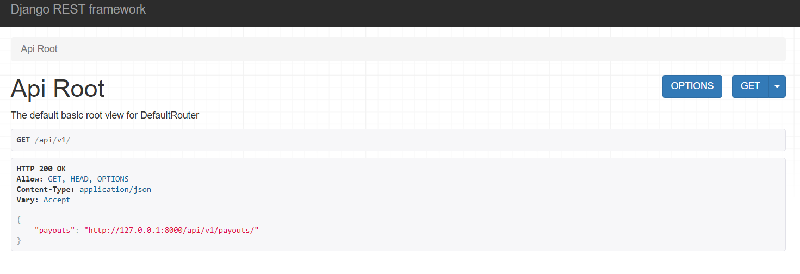
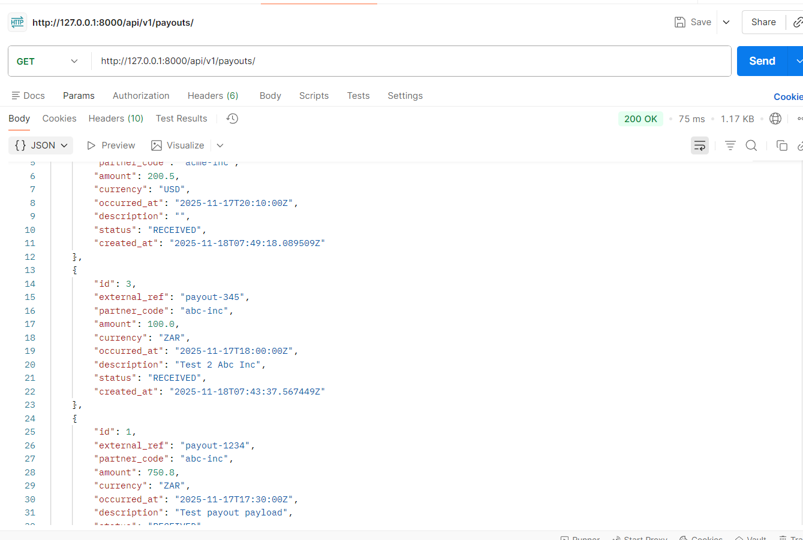
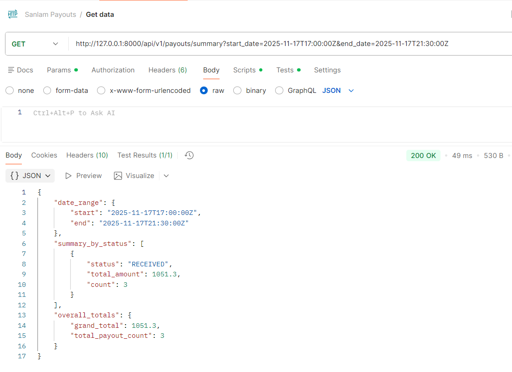
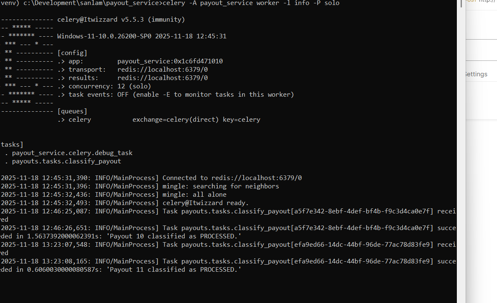
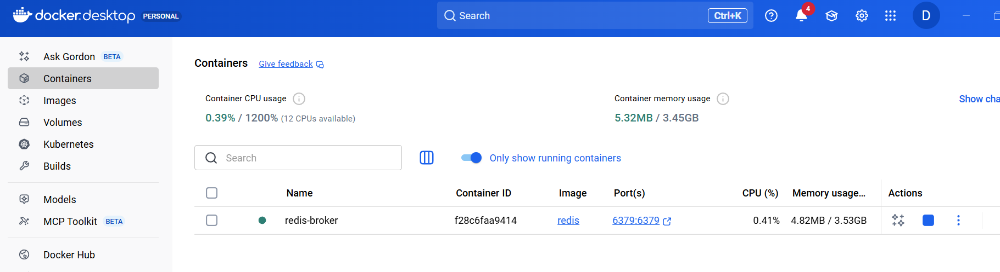
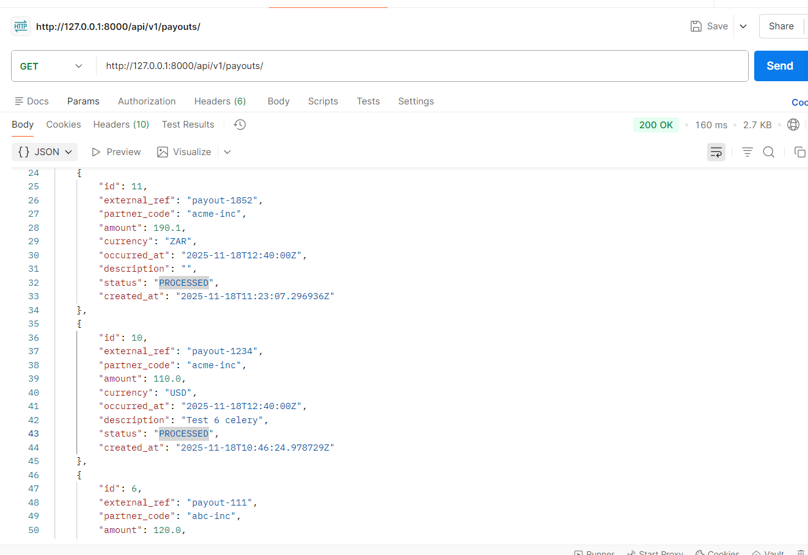
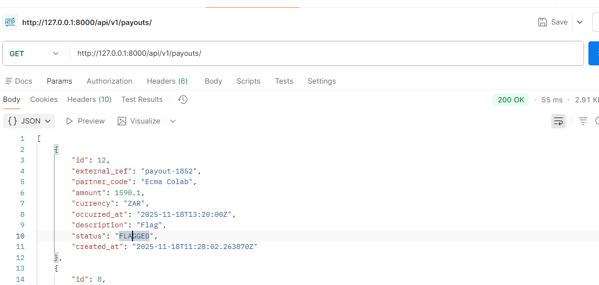
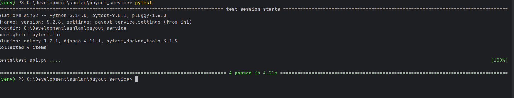

## Financial Payouts Service

This API/service handles the idempotent intake of partner payouts and generates aggregated finance summaries.


---

### Setup and Run

#### Prerequisites

* Python 3.11+
* PostgreSQL 13+
* Redis Server
* Docker Engine (Docker Desktop)
* Postman (for testing endpoints)

#### 1. Environment Setup

Clone and navigate to the project root

```
git clone https://github.com/itwizz26/sanlam-payloads.git
cd sanlam_payloads/
```

Create and activate your virtual environment
```
python -m venv venv
source venv/bin/activate  # macOS/Linux
.\venv\Scripts\activate # Windows  
```

Install dependencies (including djangorestframework, python-decouple, celery/redis, and pytest-django)
```
pip install -r requirements.txt
```

#### 2. Configuration (.env File)

Create a file named .env in the project root. There is an example.env file included
with the solution to aid with the creation. Copy this file and rename it to `.env`

#### 3. Apply database migrations
```
python manage.py migrate
```

#### 4. Run the development server

```
python manage.py runserver
```

#### 5. Start Redis and Celery

Start the redis broker for this particular build. This command will also automatically build the redis image for you.

```
docker run -d -p 6379:6379 --name redis-broker redis
```

In a separate window/terminal, start the celery worker. Ensure that you run this inside your virtual environment
and that you have admin permissions in that terminal.

```
celery -A payout_service worker -l info -P solo
```

The API will now be available at http://127.0.0.1:8000/api/v1/ for interaction.

### Running Tests
All core requirements are covered by the pytest suite. The pytest.ini file handles the necessary Django environment configuration.

From the root of the project (where the tests/ folder is), run the below command to test the solution.
```
pytest
```

#### Available API Endpoints
```
Endpoint                Method  Description
/api/v1/payouts/        POST	Accepts a new payout. Returns 201 CREATED immediately, and the 'classify_payout' task is sent to the background worker.
/api/v1/payouts/        GET     Shows all intakes/created payouts.
/api/payouts/summary/	GET     Finance Summary. Returns totals grouped by status for a specified date range. E.g.
                                /api/payouts/summary/?start_date=2025-11-17T00:00Z&end_date=2025-11-20T00:00Z
```

### Screen grabs
#### Payouts created


#### Summary payouts


#### Celery background task started


#### Redis server/broker started


#### Payout now 'PROCESSED'


#### Payout 'FLAGGED'


#### Pytests


---

Copyright &copy; 2025 [Itwizz26](https://github.com/itwizz26)